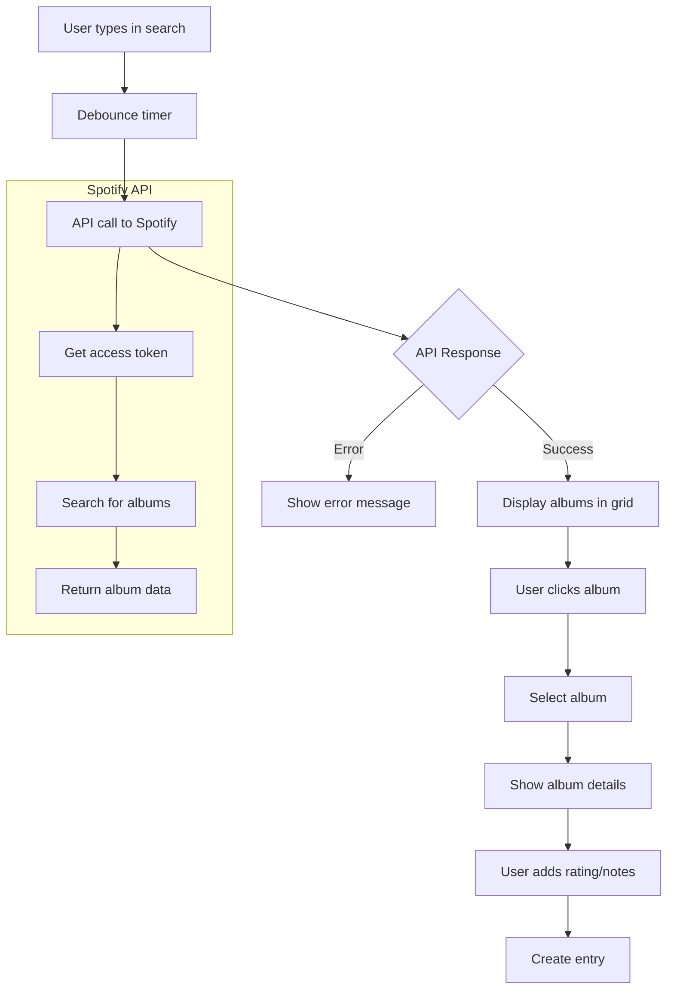

# Spotify Search Implementation Plan

## Overview

I'll implement a search component within the NewEntryPanel that queries the Spotify Web API for album information based on user-entered search queries and displays up to 6 albums in a grid below the search box.

## Architecture

### 1. Spotify API Service Module

Create a service module at `src/lib/server/spotify.ts` that will:

- Handle authentication with Spotify API using client credentials flow
- Manage access tokens (request new ones when expired)
- Provide functions for searching albums

### 2. Type Definitions

Update the Album type in `src/lib/types/album.ts` to include:

- Spotify ID
- External URLs
- Additional metadata from Spotify

### 3. Search Results Component

Create a new component `src/lib/components/SearchResults.svelte` that will:

- Display albums in a responsive grid (up to 6 albums)
- Show album artwork, name, artist, and release date
- Handle album selection
- Include loading and error states

### 4. NewEntryPanel Updates

Modify `src/lib/components/NewEntryPanel.svelte` to:

- Integrate with the Spotify API service
- Display search results using the new component
- Handle album selection
- Show selected album details
- Implement debounced search to avoid excessive API calls

## Implementation Details

### Spotify API Integration

- Use the Client Credentials Flow for authentication
- Store access tokens with expiration tracking
- Implement automatic token refresh
- Use the Search endpoint with `type=album` and `limit=6`

### Search Flow

1. User types in search input
2. After a short delay (debounce), API call is made
3. Results are displayed in a grid
4. User clicks on an album to select it
5. Selected album details are shown in the form
6. User can then add rating and notes to create an entry

### UI/UX Considerations

- Show loading state during API calls
- Handle empty results gracefully
- Display error messages for failed searches
- Make search results clickable with visual feedback
- Ensure responsive design for the grid layout

## Mermaid Diagram



## File Structure

```
src/lib/
├── server/
│   └── spotify.ts          # Spotify API service
├── types/
│   └── album.ts            # Updated Album type
└── components/
    ├── NewEntryPanel.svelte # Updated with search
    └── SearchResults.svelte # New component
```

## API Endpoints to Use

### Get Access Token

```
POST https://accounts.spotify.com/api/token
Headers:
  Authorization: Basic <base64 encoded client_id:client_secret>
  Content-Type: application/x-www-form-urlencoded

Body:
  grant_type=client_credentials
```

### Search for Albums

```
GET https://api.spotify.com/v1/search
Headers:
  Authorization: Bearer <access_token>

Query Parameters:
  q={searchQuery}
  type=album
  limit=6
  market=US
```

## Testing Strategy

1. Test with various search queries (artist names, album names, genres)
2. Test edge cases (empty results, special characters, long queries)
3. Test error handling (network errors, API limits)
4. Test album selection and form display
5. Test debouncing behavior

## Next Steps

Once this plan is approved, I'll switch to Code mode to implement the search functionality following these steps in order.
